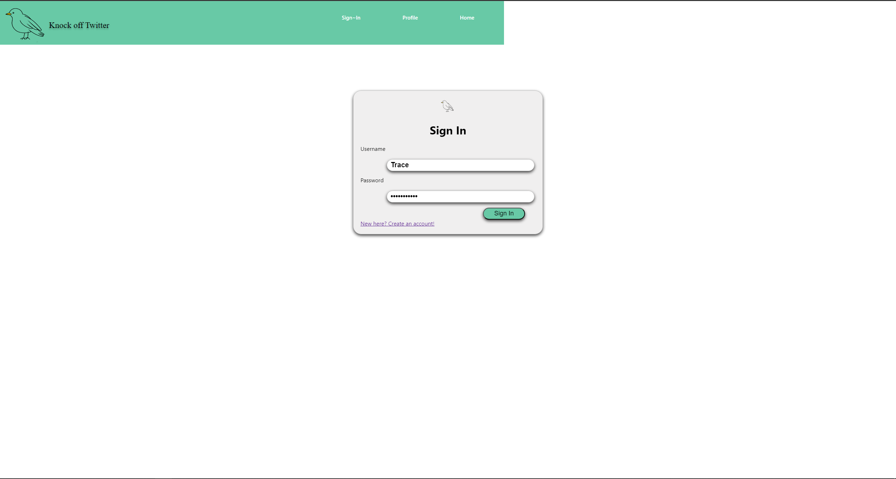

Group project website for CSCD 378

# Table of Contents
+ Screenshots
+ Frontend Installation Instructions
+ Backend Installation Instructions
+ Research
+ Changelog

# Screenshots

# Front End Instructions
- Install npm and node. If you are using Windows, it can help to install 'node version manager' from github.
- CD into the directory where the website is located. 
- Type "npm start"
- The website should open automatically in your default browser, if not try to open src/Index.js
# Back End Instructions
## Database
- You may be able to open the "Schema" file in a text editor and use the text as a creation script. Otherwise, follow these instructions:
- Install and run a MySQL Server on Localhost and create a connection to the server in MySQL workbench with the Username and Password set as "root".
- After opening the connection, in the "Navigator" section, click on "Administration" on the bottom of the section. Then, click "Data Import/Restore", then in the main tab, select "Import from Self-Contained File".
- Select the file named "Schema" from wherever you download our project.
- Then select "Start Import". Everything should be imported under a schema titled "forum".
## Spring Boot
- Make sure the database is open and running.
- In IntelliJ, select "New Project From Existing Sources".
- Go to wherever you downloaded our project and select the "SpringBackend" folder.
- Select "Import project from external model", then select "Maven".
- Click finish, then everything should be imported and there should be Run Configuration automatically set up. (You may have to wait for the Maven libraries to import and index if you don't have them already)
- Run the application, and it should launch with no errors. You can access the backend by typing "localhost:8080" (or whatever port it launched on, which it shows in the console) in your browser. This should show a JSON object containing the congregations, posts in the congregations, and comments on those posts. You can also look at the "GetMapping" annotations in the controllers if you would like to test anything specific with the connection between the application and the database.

# Website Research
https://docs.google.com/document/d/1NPWpYAwBD5oAPUVvpAJWj2N7lKmisHru3RZEa26Zu4k/edit#

# Changelog 
1/30/2023 - 2/5/2023
	Finished our presentation to the class
	Effectively started progress on the project
	Posted v1 UML wireframe of the website
	Posted the v1 UML for database schema
	We still do not have a name for the website
	
	Back-end progress:
			Added Java files for backend
		
	Front-end progress:
			index.html started
			style.css started
			Congregation.js started
2/6/2023 - 2/12/2023
	Prepared for our WCAG presentation
	
	Back-end progress:
	
	Front-end progress:
			figma configured properly
2/13/2023 - 2/19/2023
	presented our WCAG topics and solutions
	
	Back-end progress: 
			database queries for jscript written
	
	Front-end progress:
			css started
	
2/20/2023 - 2/26/2023

	Back-end progress: 
			finished jscript queries
			started on websocket
				
	
	Front-end progress: 
			various skeleton pages added
	
	
2/27/2023 - 3/5/2023
	Started implementation of cookies
	Core of the website still under development
	Back-end data structures almost finished
	
	Back-end progress:
			Copied all queries from jscript to Springboot
			
	Front-end progress:
			Furthered development of CSS code
			Polished the React code
			Implemented Avatars for users
			
3/6/2023 - 3/12/2023
	Fixed the CSS and functionality for the navbar
	many CSS additions to navbar, new profile, congregation
	
	Back-end progress:
			Worked on connection between DB and front-end
	Front-end progress:
			CSS additions
	
